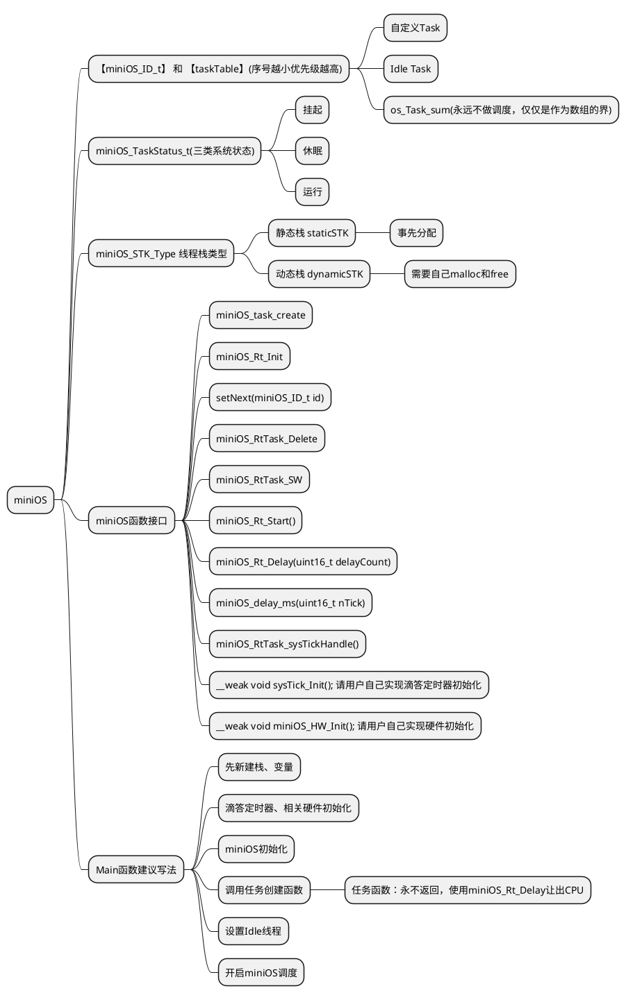
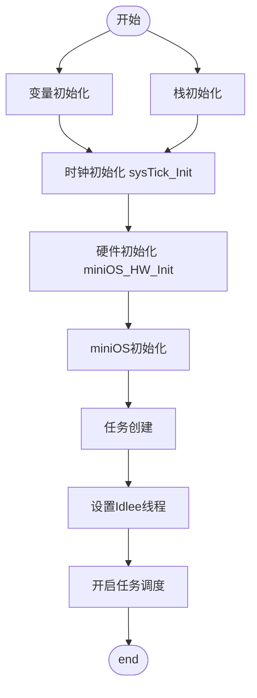

<center>   miniOS v2 小记   </center>
===

- **HNU HaiKou Mei Lan**
- **项目：——miniOS小型多任务系统设计**
- **功能：适配Cortex M3**
- **致谢：感谢rt_thread的项目**
- **copyright v2.0 2022.07.31**
————————————————————
- **功能：适配Cortex M0**
- **致谢：感谢uC/os II的项目**
- **copyright v2.1 2022.08.04**
————————————————————
- **功能：增加信号量，现在是结构体数组的方式**
- **有信号量初始化和take\give两个函数**
- **可以进行单信号量在两个线程间的乒乓实验**
- **copyright v2.2 2022.08.11**

> - 这个项目起源于在使用RT-thread nano中的一点兴趣，然后就写了这个miniOS  
> - 第一版本我采用的是时间片轮转执行的方案，和之前的前后台系统没有差别，但是逻辑性增加了  
> - 第二版本我采用的是实时系统的方案，利用了上下文切换和可悬浮中断，实现了非阻塞延时


1、miniOS相关类型定义
---  
```c  
typedef enum {  
    os_Task_sys = 0,  
	os_Task_gui,  
    os_Task_key,  
    os_Task_led,  
    os_Task_wifi,
    os_Task_uart,  
    os_Task_test,  
    os_Task_idle,//空闲线程永远在os_Task_sum计数之前，所有线程之后  
    os_Task_sum  
}miniOS_ID_t;//线程ID定义，ID越小优先级越高  

typedef enum {  
    os_suspend=0,//挂起  
    os_sleep,    //睡眠或者说就绪  
    os_run       //运行  
}miniOS_TaskStatus_t;  

typedef enum {  
	staticSTK = 0,  
	dynamicSTK  
}miniOS_STK_Type;  

```

2、实时任务结构体
---
```c
/*实时任务结构体*/
/*
    * 【!!! 重要信息 Attion】
	* 正是因为结构体第一个变量是栈指针
	* 因此巧妙的现象出现了【线程栈指针 === 线程结构体指针】 
	* 方便了汇编代码和内核代码的书写 
    * miniOS_STK  *stackptr;            # 线程栈地址，stk数组尾部减一的地址，&xStack[XStackSize -1]
	* void (*task)(void *arg);          # 线程入口函数
	* void *taskentry;                  # 线程入口函数
	* void *sp;                         # 栈基地址 xStack
	* int  thisID;                      # 线程ID号
	
	* uint16_t stackSize;               # 线程栈大小
	
	* miniOS_TaskStatus_t runflag;      # 线程状态，os_suspend,os_sleep,os_run
	* miniOS_TaskStatus_t runState;     # 线程状态寄存器
	* uint16_t runPerid ;               # 线程时间片
	* uint16_t runTimer ;               # 线程时间片计数器
	* uint32_t nextTime ;               # 线程挂起时间
*/
typedef struct miniOS_RtTask_s{
	miniOS_STK  *stackptr;
	void (*task)(void *arg);
	void *taskentry;
	void *sp;
	int  thisID;
	uint16_t stackSize;
	
	miniOS_TaskStatus_t runflag;
	miniOS_TaskStatus_t runState;
	uint16_t runPerid ;
	uint16_t runTimer ;
	uint32_t nextTime ;
	
}miniOS_RtTask_t,*miniOS_RtTask_p;
```
> !!! 重要信息 重要信息
>	* 正是因为结构体第一个变量是栈指针
>	* 因此巧妙的现象出现了【线程栈指针 === 线程结构体指针】 
>	* 方便了汇编代码和内核代码的书写 


3、任务函数接口
---
```c
/*miniOS RT 任务结束函数*/
void Task_End(); 

/*miniOS RT 线程创建(注册)函数*/
/*
* miniOS_ID_t wantRegTaskId,  # 线程表中的ID号
* miniOS_TASK task,           # 线程入口地址 void (*taskEntry)(void *arg)
	* taskEntry sample:
		void taskEntry(void *arg)
		{
			NEW  Variables;
			SOME init;
			WHILE(1){
            		   TO DO YOUR THINGS;
			}
		}

* miniOS_STK_Type stkTtpe,    # 线程栈类型
* miniOS_STK *stackBaseptr    # 线程栈基地址
* miniOS_STK *stackptr ,      # 线程栈底地址，采用递减栈空间使用

* miniOS_TaskStatus_t runflag,# 线程调度第一次标志
* uint16_t runPerid,          # 线程拥有时间片
* uint16_t runTime            # 线程延迟启动时间，配合os_suspend标志
*/
void miniOS_task_create(miniOS_ID_t wantRegTaskId,
		       miniOS_TASK task,  
		       miniOS_STK_Type stkTtpe,
                       miniOS_STK *stackBaseptr,  
		       miniOS_STK *stackptr,
		       //uint16_t   stacksize,
		       miniOS_TaskStatus_t runflag,
		       uint16_t runPerid,
 		       uint16_t runTime);
 
/*miniOS RT系统初始化*/
void miniOS_Rt_Init();
   
/*miniOS RT设置下一次线程调度指针*/
void setNext(miniOS_ID_t id);

/*miniOS RT 线程删除函数*/
void miniOS_RtTask_Delete(miniOS_ID_t taskID);

/*miniOS RT 线程切换函数*/
void miniOS_RtTask_SW();

/*miniOS RT 系统调度启动函数*/
void miniOS_Rt_Start();

/*miniOS RT 系统延时函数*/
void miniOS_Rt_Delay(uint16_t delayCount);
  
/*阻塞延时函数*/
void miniOS_delay_ms(uint16_t nTick);
	
/*miniOS RT 滴答定时器服务函数*/
/*todo : 将此函数放入void SysTick_Handler(void)
 *sample:
	void SysTick_Handler(void)
	{
	   miniOS_RtTask_sysTickHandle();
	}
*/
void miniOS_RtTask_sysTickHandle();

```
4、请用户自己实现以下两个函数
---
```c
/*请用户自己实现滴答定时器初始化*/
__weak void sysTick_Init();

/*请用户自己实现硬件初始化*/
__weak void miniOS_HW_Init();
```

5、main程序如何书写
---
<center>

>  main函数推荐的程序结构如下：

```flow
start=>start=>start: 开始  
input1=>inputoutput: 变量与栈初始化  
opt1=>operation: 时钟初始化：sysTick_Init()
opt2=>operation: 硬件初始化：miniOS_HW_Init()
opt3=>operation: 系统初始化：miniOS_Rt_Init()
opt4=>operation: 线程创建:miniOS_task_create(……);
opt5=>operation: 设置空闲线程setNext(os_Task_idle)
opt6=>operation: 进入OS调度：miniOS_Rt_Start();
end=>end: 结束

start->input1->opt1->opt2->opt3->opt4->opt5->opt6->end

```
</center>


6、思维导图
---



7、流程图
---
<center>


</center>

8、增加信号量
---
##### 8.1 信号量结构体

##### 8.2 信号量接口函数和功能


